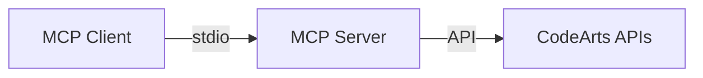
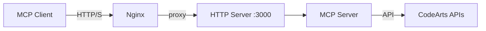
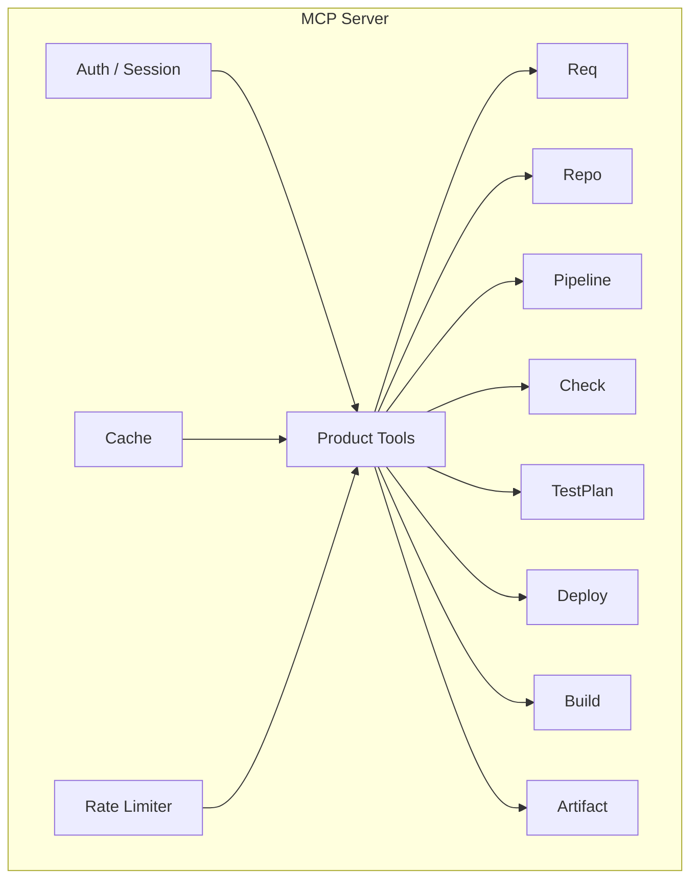

# CodeArts MCP

> 面向华为云 CodeArts 中国站的统一 MCP Server，将 8 个产品模块封装为标准化 MCP 工具集，支持本地 stdio 与团队共享 http 两种接入模式。

## 特性亮点

- **8 模块统一封装** — Req / Repo / Pipeline / Check / TestPlan / Deploy / Build / Artifact 一站式覆盖
- **双模式接入** — stdio 适合个人本地使用，http + session 适合团队共享部署
- **会话隔离** — 共享模式下每个用户使用自己的 AK/SK，互不干扰
- **加密持久化** — 凭证经 AES-256-GCM 加密落盘，服务重启后可恢复会话
- **Cookie / Token 双恢复** — 客户端保留 Cookie 或固定 auth_token 均可无缝重连
- **速率限制** — 写操作内置 per-session 限流，防止误操作风暴
- **缓存加速** — 高频读工具带共享缓存与 in-flight dedupe，命中后毫秒级响应

## 技术栈

| 类别 | 技术 | 版本 |
| --- | --- | --- |
| 运行时 | Node.js | 22 (Alpine) |
| 语言 | TypeScript | 5.8+ |
| MCP 协议 | @modelcontextprotocol/sdk | 1.12+ |
| 数据校验 | Zod | 3.24+ |
| 测试 | Vitest | 4.1+ |
| 构建 | tsc + esbuild | — |
| 代码规范 | ESLint | 9.0+ |
| 容器 | Docker + Docker Compose | — |
| 反向代理 | Nginx | — |

## 架构概览

### stdio 模式



### http 模式



### 内部结构



## 快速开始

### 1. 启动共享服务

```bash
cp .env.example .env
# 编辑 .env，至少填写 MCP_AUTH_MASTER_KEY
docker compose up -d --build
```

或宿主机直跑：

```bash
npm install && npm run build
node dist/src/server/index.js
```

### 2. 客户端添加服务

```json
{
  "mcpServers": {
    "codearts-shared": {
      "type": "http",
      "url": "http://your-server-ip/mcp"
    }
  }
}
```

若客户端不保留 Cookie，可将 auth_token 固定到 URL：

```json
{
  "mcpServers": {
    "codearts-shared": {
      "type": "http",
      "url": "http://your-server-ip/mcp?auth_token=replace-with-auth-token"
    }
  }
}
```

### 3. 首次鉴权

连接后调用 `auth_configure_session`：

```json
{
  "access_key": "your-ak",
  "secret_key": "your-sk",
  "region": "cn-north-4"
}
```

### 4. 验证连通

以下四个读工具能正常返回即表示接通成功：

| 验证工具 | 所属模块 |
| --- | --- |
| `req_list_projects` | Req |
| `repo_list_repositories` | Repo |
| `pipeline_list_pipelines` | Pipeline |
| `build_list_jobs` | Build |

## 部署方式

### 部署方式对比

| 特性 | Docker Compose | PM2 + Nginx | 本地 stdio |
| --- | --- | --- | --- |
| 适用场景 | 团队共享（推荐） | 团队共享（无 Docker） | 个人本地 |
| 隔离性 | 容器隔离 | 进程级隔离 | 无隔离 |
| HTTPS | docker-compose.ssl.yml | Nginx 配置 | 不适用 |
| 会话持久化 | 支持 | 支持 | 不适用 |
| 运维复杂度 | 低 | 中 | 最低 |
| 水平扩展 | 可配合负载均衡 | 可配合负载均衡 | 不适用 |
| 健康检查 | 内置 /health | 需手动配置 | 不适用 |

### Docker Compose 部署（推荐）

```bash
# HTTP
docker compose up -d --build

# HTTPS（需先准备证书，见 deploy/nginx/ssl/）
docker compose -f docker-compose.ssl.yml up -d --build
```

必需环境变量：

```env
MCP_TRANSPORT=http
MCP_HTTP_PORT=3000
MCP_SERVER_NAME=codearts-mcp
MCP_SERVER_VERSION=0.1.0
MCP_AUTH_MASTER_KEY=replace-with-a-long-random-secret
MCP_AUTH_DATA_PATH=.codearts-mcp/auth-store.json
```

### PM2 部署

使用项目提供的部署脚本：

```bash
# 初始化
bash deploy/bootstrap-shared.sh

# 部署前自检
bash deploy/preflight-shared.sh

# 启动/停止/重启
bash deploy/manage-shared-pm2.sh start|stop|restart
```

| 脚本 | 用途 |
| --- | --- |
| `deploy/bootstrap-shared.sh` | 初始化环境与目录结构 |
| `deploy/preflight-shared.sh` | 部署前自检 |
| `deploy/manage-shared-pm2.sh` | PM2 进程管理 |
| `deploy/ops-shared.sh` | 运维工具集 |
| `deploy/manage-shared.sh` | Docker Compose 管理 |

### 本地 stdio

```env
MCP_TRANSPORT=stdio
HUAWEICLOUD_AK=your-ak
HUAWEICLOUD_SK=your-sk
HUAWEICLOUD_REGION=cn-north-4
MCP_SERVER_NAME=codearts-mcp
MCP_SERVER_VERSION=0.1.0
```

客户端启动命令：

```bash
node dist/src/server/index.js
```

## 模块现状总表

<!-- GENERATED:readme-exposure-summary:start -->
- `8` product modules
- `308` product tools
- `2` session/auth tools for shared `http` mode
- `310` total MCP tools in shared `http` mode
<!-- GENERATED:readme-exposure-summary:end -->

工具读写分布：读操作 177 (63.7%) / 写操作 101 (36.3%)

<!-- GENERATED:readme-module-numbers:start -->
| Module | Tools | Live status | Current breakdown |
| --- | --- | --- | --- |
| Req | 98 | Partial | Expanded Req surface with current-user info/role reads, project bug/summary/statistics reads, work-item-tree count/list, work-item tag/index-count reads, project work-item history reads, child work-item reads, work-hours, issue image upload/download, attachment upload/download/delete, associated wiki reads, plan work-item management, plan image update, plan-context work item creation, project due-days-after/workhour-config reads, status/status-attribute/status-detail/workflow-config/template/template-config/custom-field/status-rule-flag/status-config/optional-status-config/tracker-handler and project-public-config reads plus field/cache reads and board work-item reads; see `docs/wiki/Req-Live-Validated.md` for validated paths and remaining live-depth gaps |
| Repo | 25 | Validated | `25 Full / 0 Reachable / 0 Unpublished / 0 Code` |
| Pipeline | 77 | Partial | `16 Full / 0 Reachable / 0 Unpublished / 51 Code` |
| Check | 8 | Validated | `8 Full` |
| TestPlan | 7 | Partial | `1 Full / 2 Reachable / 4 Unpublished / 0 Code` |
| Deploy | 59 | Partial | Expanded v4 surface with partial live closure; see `docs/wiki/Module-Live-Readiness.md` |
| Build | 22 | Validated | `22 Full / 0 Reachable / 0 Unpublished / 0 Code` |
| Artifact | 12 | Partial | `5 Full / 0 Reachable / 7 Unpublished / 0 Code` |
<!-- GENERATED:readme-module-numbers:end -->

Live 状态说明：

| 状态 | 含义 |
| --- | --- |
| Validated | 所有工具已通过真实 AK/SK 联调验证 |
| Partial | 部分工具已验证，其余可用但受租户样本或区域发布限制 |

## 环境变量参考

### 必需变量

| 变量 | 说明 | 默认值 |
| --- | --- | --- |
| `MCP_TRANSPORT` | 传输模式：`http` 或 `stdio` | — |
| `MCP_SERVER_NAME` | 服务名称 | — |
| `MCP_SERVER_VERSION` | 服务版本 | — |
| `MCP_AUTH_MASTER_KEY` | 会话加密主密钥（http 模式必需） | — |

### 可选变量

| 变量 | 说明 | 默认值 |
| --- | --- | --- |
| `MCP_HTTP_PORT` | HTTP 监听端口 | `3000` |
| `MCP_AUTH_DATA_PATH` | 加密凭证持久化路径 | `.codearts-mcp/auth-store.json` |
| `MCP_AUTH_COOKIE_SECURE` | HTTPS 环境下设置 Cookie Secure 标志 | `false` |
| `HUAWEICLOUD_AK` | 默认 AK（stdio 模式） | — |
| `HUAWEICLOUD_SK` | 默认 SK（stdio 模式） | — |
| `HUAWEICLOUD_REGION` | 默认区域（stdio 模式） | — |

### 产品 URL 覆盖（cn-north-4 默认值）

标准区域会根据 `region` 自动推导，通常无需手动填写。以下为 `cn-north-4` 默认映射：

| 变量 | 默认值 |
| --- | --- |
| `REQ_BASE_URL` | `https://projectman-ext.cn-north-4.myhuaweicloud.com` |
| `REPO_BASE_URL` | `https://codehub-ext.cn-north-4.myhuaweicloud.com` |
| `PIPELINE_BASE_URL` | `https://cloudpipeline-ext.cn-north-4.myhuaweicloud.com` |
| `CHECK_BASE_URL` | `https://codecheck-ext.cn-north-4.myhuaweicloud.com` |
| `TESTPLAN_BASE_URL` | `https://cloudtest-ext.cn-north-4.myhuaweicloud.com` |
| `DEPLOY_BASE_URL` | `https://codearts-deploy.cn-north-4.myhuaweicloud.com` |
| `BUILD_BASE_URL` | `https://cloudbuild-ext.cn-north-4.myhuaweicloud.com` |
| `ARTIFACT_BASE_URL` | `https://artifact.cn-north-4.myhuaweicloud.cn` |

## 常用命令

| 命令 | 说明 |
| --- | --- |
| `npm run dev` | 开发模式启动（stdio） |
| `npm run dev:http` | 开发模式启动（http） |
| `npm run build` | TypeScript 编译 |
| `npm test` | 运行测试 |
| `npm run test:fast` | 快速测试（无隔离） |
| `npm run test:isolate` | 隔离模式测试 |
| `npm run lint` | 代码规范检查 |
| `npm run stats:modules` | 输出模块统计 |
| `npm run stats:check-docs` | 检查 README/Wiki 统计块是否漂移 |
| `npm run stats:sync-docs` | 同步自动统计区块到文档 |
| `npm run probe:edge` | 对共享 HTTP 入口做多轮连通性与延迟采样 |

## 安全特性

| 特性 | 说明 |
| --- | --- |
| 会话隔离 | 共享模式下每个用户独立会话，AK/SK 互不可见 |
| 加密持久化 | 凭证使用 AES-256-GCM 加密，密钥由 MCP_AUTH_MASTER_KEY 派生 |
| Cookie / Token 恢复 | 支持 Cookie 自动重连或 auth_token 固定重连，无需重复输入凭证 |
| HTTPS 支持 | 通过 docker-compose.ssl.yml 或 Nginx 配置启用，生产环境建议启用 MCP_AUTH_COOKIE_SECURE |
| 写操作速率限制 | 内置 per-session 限流，防止误操作或自动化脚本产生写风暴 |
| 凭证清除 | 调用 auth_clear_session 可立即撤销当前用户的持久化凭证 |

运维注意：`MCP_AUTH_MASTER_KEY` 和 `MCP_AUTH_DATA_PATH` 必须稳定保存，否则服务重启后无法恢复已有会话。

## 项目结构

```text
codearts-mcp/
├── src/
│   ├── server/            # 服务入口、工具注册、会话管理
│   ├── products/          # 8 个产品模块（artifact/build/check/deploy/pipeline/repo/req/testplan）
│   ├── core/              # 通用能力（auth/cache/config/errors/http/pagination）
│   └── contracts/         # 共享类型与校验 schema
├── deploy/                # 部署脚本与 Nginx 配置
├── tests/                 # 测试用例（与 src 镜像目录结构）
├── Dockerfile             # 两阶段构建，node:22-alpine，暴露 3000，健康检查 /health
├── docker-compose.yml     # HTTP 模式
├── docker-compose.ssl.yml # HTTPS 模式
├── ecosystem.config.cjs   # PM2 配置
└── vitest.config.ts       # 测试配置
```

## 故障排查

| 现象 | 可能原因 | 解决方案 |
| --- | --- | --- |
| `GET /health` 无响应 | 服务未启动或端口未暴露 | 检查 `docker compose logs`；确认 MCP_HTTP_PORT 映射 |
| `auth_configure_session` 返回失败 | AK/SK 错误或区域不支持 | 确认 AK/SK 有效且 region 填写正确（如 cn-north-4） |
| Cookie 重连后仍需重新鉴权 | MCP_AUTH_MASTER_KEY 变更或数据文件丢失 | 确认 MASTER_KEY 和 AUTH_DATA_PATH 在重启间保持不变 |
| 写操作被限流 | 触发 per-session 速率限制 | 等待限流窗口重置，或减少并发写操作 |
| 某模块工具返回区域不可用 | 该产品尚未在当前区域发布 | 检查模块 Live 状态；参考区域 URL 默认映射 |
| `tools/list` 为空 | stdio 模式下环境变量缺失 | 确认 HUAWEICLOUD_AK/SK/REGION 已设置 |
| HTTPS 下 Cookie 不生效 | 未设置 MCP_AUTH_COOKIE_SECURE | 启用 HTTPS 后设置 `MCP_AUTH_COOKIE_SECURE=true` |
| Docker 构建失败 | Node 版本或依赖不匹配 | 确认 Dockerfile 基础镜像为 node:22-alpine；执行 `npm ci` |

## 进阶文档入口

### 入门与部署

1. `docs/wiki/Home.md` — 项目总览
2. `docs/wiki/Getting-Started.md` — 详细上手指南
3. `docs/wiki/Team-Deployment.md` — 团队部署方案
4. `docs/wiki/Testing-and-Live-Ops.md` — 测试与线上运维
5. `docs/wiki/Troubleshooting.md` — 故障排查手册

### 架构与能力

- `docs/product-overview.md` — 产品概览
- `docs/service-profile.md` — 服务画像
- `docs/wiki/Architecture-Deep-Dive.md` — 架构深潜
- `docs/wiki/Capability-Matrix.md` — 能力矩阵
- `docs/wiki/Module-Live-Readiness.md` — 模块 Live 就绪状态

### API 对齐

- `docs/wiki/Official-API-Alignment.md` — 官方 API 对齐总览
- `docs/wiki/Official-PDF-MCP-Coverage-Summary.md` — PDF 覆盖摘要
- `docs/wiki/Official-Category-Coverage-Matrix.md` — 分类覆盖矩阵
- `docs/wiki/Official-Endpoint-Mapping-Req-Repo-Pipeline.md` — Req/Repo/Pipeline 端点映射
- `docs/wiki/Official-Endpoint-Mapping-Check-Build-Deploy-Artifact-TestPlan.md` — Check/Build/Deploy/Artifact/TestPlan 端点映射

### 模块验证

- `docs/wiki/Req-Live-Validated.md`
- `docs/wiki/Check-Live-Validated.md`
- `docs/wiki/Build-Live-Validated.md`
- `docs/wiki/Deploy-Live-Validated.md`
- `docs/wiki/Artifact-Live-Validated.md`
- `docs/wiki/TestPlan-Live-Validated.md`
