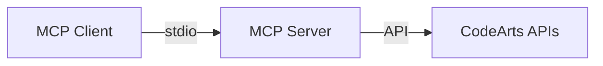
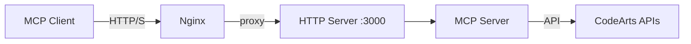
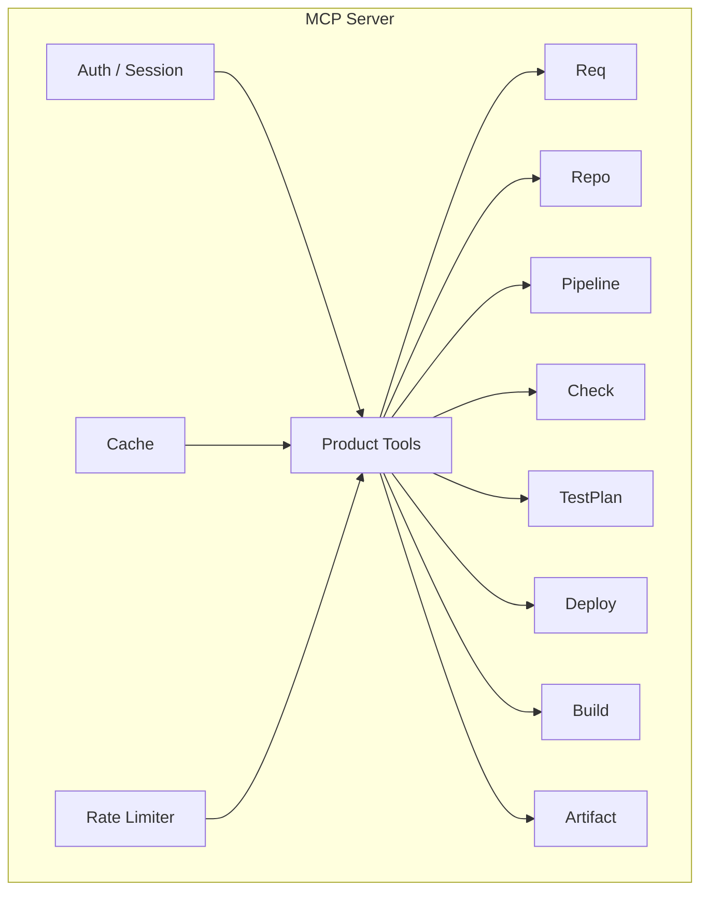

Based on the provided code map and original README content, I can see this is a comprehensive MCP (Model Context Protocol) server project for Huawei Cloud CodeArts. Let me provide a properly formatted README:

---

# CodeArts MCP

> 面向华为云 CodeArts 中国站的统一 MCP Server，将 8 个产品模块封装为标准化 MCP 工具集，支持本地 stdio 与团队共享 http 两种接入模式。

## 特性亮点

- **8 模块统一封装** — Req / Repo / Pipeline / Check / TestPlan / Deploy / Build / Artifact 一站式覆盖
- **双模式接入** — stdio 适合个人本地使用，http + session 适合团队共享部署
- **会话隔离** — 共享模式下每个用户使用自己的 AK/SK，互不干扰
- **加密持久化** — 凭证经 AES-256-GCM 加密落盘，服务重启后可恢复会话
- **Cookie / Token 双恢复** — 客户端保留 Cookie 或固定 auth_token 均可无缝重连
- **速率限制** — 写操作内置 per-session 限流，防止误操作风暴
- **缓存加速** — 高频读工具带共享缓存与 in-flight dedupe，命中后毫秒级响应

## 技术栈

| 类别 | 技术 | 版本 |
| --- | --- | --- |
| 运行时 | Node.js | 22 (Alpine) |
| 语言 | TypeScript | 5.8+ |
| MCP 协议 | @modelcontextprotocol/sdk | 1.12+ |
| 数据校验 | Zod | 3.24+ |
| 测试 | Vitest | 4.1+ |
| 构建 | tsc + esbuild | — |
| 代码规范 | ESLint | 9.0+ |
| 容器 | Docker + Docker Compose | — |
| 反向代理 | Nginx | — |

## 架构概览

### stdio 模式



### http 模式



### 内部结构



## 快速开始

### 1. 启动共享服务

```bash
cp .env.example .env
# 编辑 .env，至少填写 MCP_AUTH_MASTER_KEY
docker compose up -d --build
```

或宿主机直跑：

```bash
npm install && npm run build
node dist/src/server/index.js
```

### 2. 客户端添加服务

```json
{
  "mcpServers": {
    "codearts-shared": {
      "type": "http",
      "url": "http://your-server-ip/mcp"
    }
  }
}
```

当前已部署的共享服务可以直接使用下面这份配置：

```json
{
  "mcpServers": {
    "codearts-shared": {
      "disabled": false,
      "timeout": 60,
      "type": "streamableHttp",
      "url": "http://39.106.183.205/mcp"
    }
  }
}
```

若客户端不保留 Cookie，请使用 `Authorization: