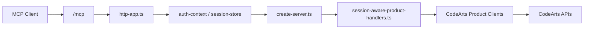

# Architecture Deep Dive

这页不重复目录树，而是从真实代码结构解释这个项目是怎么把“共享 MCP 服务 + 每用户独立 CodeArts 凭证”这件事做起来的。

## 1. 入口层

核心入口在 `src/server/index.ts`。

- `MCP_TRANSPORT=http` 时走 `startHttpServer()`
- 其他情况默认走 `startStdioServer()`

这意味着项目天然支持两套运行模型：

- `stdio`：本地单用户，配置来自进程环境变量
- `http`：共享服务入口，配置只保留服务元数据，业务凭证通过会话动态注入

## 2. HTTP 模式的数据流

`src/server/http-app.ts` 负责：

- 暴露 `/health` 与 `/mcp`
- 解析请求体和 MCP method
- 管理 Cookie / `auth_token`
- 组装请求日志和诊断信息
- 在服务启动时预热持久化鉴权仓库

## 3. 会话与鉴权

共享 `http` 模式下，凭证不是存在进程内存里就结束，而是走了完整的会话体系。

### 3.1 会话解析

`http-app.ts` 会结合 Cookie、`auth_token` 和请求上下文恢复用户身份，再交给 `create-server.ts` 生成带会话感知能力的 MCP Server。

### 3.2 持久化存储

`src/server/auth-repository.ts` 实现了文件型持久化仓库：

- 凭证写入 JSON 文件
- 读写前会做签名检查，避免频繁重复加载
- 支持按 `auth_id` / `token_hash` 读记录
- 支持 `touch`、过期时间更新和撤销

### 3.3 加密策略

持久化内容不是明文 `AK/SK`，而是加密后的结构化记录。README 里的 `MCP_AUTH_MASTER_KEY` 就是这套机制的根密钥。

## 4. 工具注册层

真正把 8 个产品模块挂到 MCP Server 上的核心在两层：

- `src/server/create-server.ts`
- `src/server/product-tool-registry.ts`

其中：

- `create-server.ts` 负责搭建服务器、注册 auth/session 工具、为写操作挂限流器、拼装最终工具集
- `product-tool-registry.ts` 负责把“产品工具定义”转成真正注册到 MCP 上的 handler，并统一包一层错误格式化

这层设计的好处是：

- `stdio` 和 `http` 共用同一套产品工具定义
- `http` 模式只是在 handler 外层额外做会话注入、限流和鉴权恢复
- 新工具增加时不需要重复写一遍 stdio/http 双版本

## 5. Session-aware 产品工具

`src/server/session-aware-product-handlers.ts` 是整个项目里最关键的桥接层之一。

它做的事情不是“列个目录”，而是把每个产品的原始 client handler，包装成会从当前会话里解析凭证、创建对应产品 client、再去调用真实 CodeArts API 的 session-aware handler。

这层把两类复杂性隔离掉了：

- 产品实现关注自己的 client / schema / tool input/output
- 服务实现关注会话、鉴权、限流、缓存和错误提示

## 6. 限流与安全写路径

`src/server/rate-limiter.ts` 当前实现的是固定窗口限流器：

- 默认针对写操作
- 维度是每个会话
- 窗口内超过阈值直接返回 `429`

它的目标不是做高精度网关级流控，而是防止共享 MCP 环境里的误操作风暴。

## 7. 读缓存与性能

配置层在 `src/core/config/env.ts` 中支持几类高频读工具 TTL：

- Req 项目列表
- Repo 仓库列表
- Pipeline 流水线列表
- Build 任务列表

这部分的设计方向很明确：对高频读路径做共享缓存和 in-flight dedupe，尽量把重复读取从“多次上游请求”变成“一次上游请求 + 多次复用”。

## 8. 产品分层

每个产品模块基本遵循相同结构：

- `client.ts`：封装真实 CodeArts HTTP 调用
- `schemas.ts`：定义输入输出和可复用 schema
- `tools/*.ts`：每个 MCP 工具各自的 handler

当前工具规模最大的模块是：

- Pipeline：`77`
- Deploy：`59`
- Repo：`25`

这也解释了为什么 Pipeline 和 Deploy 的文档与 live 状态需要单独强调。

## 9. 测试结构

测试目录和源码基本镜像：

- `tests/products/*`：产品级 client / tool / live smoke
- `tests/server/*`：HTTP、会话、限流、工具注册、写路径联调

项目目前不是只靠 unit test 说自己“可用”，而是把一部分关键路径做到了真实 AK/SK 联调，包括：

- `auth_configure_session`
- `repo_create_repository`
- `req_create_work_item`
- `pipeline_run_pipeline`
- 部分 `deploy_*` 写路径

## 10. 架构上的现实结论

这个项目当前最成熟的部分不是“代码行数最多的模块”，而是下面这几条工程链路：

- `stdio` / `http` 双模式共存
- 共享入口下的独立会话鉴权
- 受控写路径的限流和错误提示
- 以真实 AK/SK 为准绳的 live smoke 回归

如果你要继续深入，建议下一步看：

- [Capability-Matrix](./Capability-Matrix.md)
- [Module-Live-Readiness](./Module-Live-Readiness.md)
- [Testing-and-Live-Ops](./Testing-and-Live-Ops.md)
